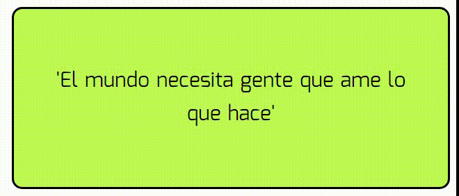

# Random Box - React

## Objetivo:
Desarrollar página que al refrescar cambie el estilo de la caja como por ejemplo el color del fondo y su font family.

## Componentes:

- App
- Box

## Resultado:

## Autora:

Laura Jimenez Hidalgo